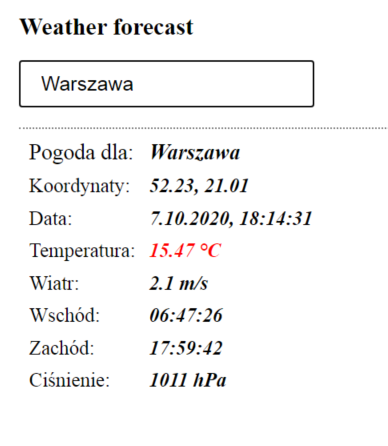

## weather forecast for city in JavaScript fetch

#### Design features

* mede in JavaScript
* asynchronous requests taking JSON data
* REST API used by fetch
* dynamic data after typing into input
* current weather data for the city you type
* info - about 200.000 cities  with weather

#### Before using
* before using it, you need to enter API key in the file - script.js, info in README
* key download page - [Link to page](https://openweathermap.org/api "link to API key")

#### Image of the page

